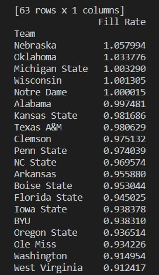
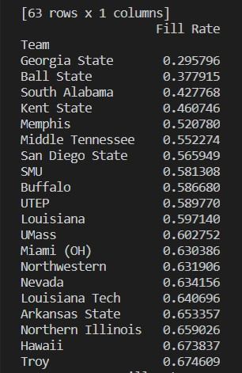

# Data Analysis

Author, Conner Pohlsander

## Overview

I have had an interest in college football for most of my life. I especially like the data side of sports, which is my focus for this analysis. For this analysis, I will analyze data pertaining to attendance for football games over a time period from 2000-2018 for 63 different teams in college football. I have three questions that I am looking to answer:
* **Which universities struggle the least to fill their football stadiums and which struggle the most?**
* **Which college football conferences do the best with filling their stadiums?**
* **Has attendance at games been declining across the sport?**

## Development Environment

* Python 3.8.2
* Visual Studio Code
* Python extension for VS Code
* Pandas package for Python
* Seaborn package for Python

## Execution

### Getting Started

First, the pandas and seaborn packages for Python need to be downloaded. Add the following code to activate the packages:

```
import pandas as pd
import seaborn as sns
```

The next step is to find and add data in csv format. I used [this data](https://www.kaggle.com/jeffgallini/college-football-attendance-2000-to-2018). The code for reading in this data uses the pandas package and looks like this:

```
teams = pd.read_csv("CFBeattendance.csv", encoding = "ISO-8859-1")
```

I had to specify encoding since my data had characters not normally recognized. With the data loaded in, I could move on to answering my questions.

### Which universities struggle the least to fill their football stadiums and which struggle the most?

To answer this question I would need to average out the "fill rate" (percentage of fans attending a game compared to capacity of the stadium) and group that by each team and then have two lists showing the teams struggling the most with attendance and the ones struggling the least. This is the code I used to answer that question:

```
mean = teams[["Team", "Fill Rate"]].groupby("Team").mean()

print(f"Mean: {mean}")

print(mean[["Fill Rate"]].sort_values("Fill Rate", ascending=False).head(20))

print(mean[["Fill Rate"]].sort_values("Fill Rate", ascending=True).head(20))
```

Here is the results for both of those print statements:



From this result, we can conclude Nebraska struggles the least with attendance, and consistently has fans attending above the capacity of the stadium. Boise State is the team that has the highest fill rate that is not in a power conference. This is probably due to the consistent success of the program.



From this result we can see that Georgia State has had the lowest fill rate. Much of this has to do with the fact they haven't played at the Division 1-A level for very long and their old stadium was the Georgia Dome, which is a massive stadium in comparison to most of the other schools on this list. Ball State does not have these same excuses. This makes me believe Ball State has truly pathetic attendance. Northwestern is the only team from a power conference to appear on this list.

### Which college football conferences do the best with filling their stadiums?

This question can be answered in a similar way to the last question, but is instead grouped by conference instead of team. 

## Helpful Links

* [https://www.kaggle.com/jeffgallini/college-football-attendance-2000-to-2018](https://www.kaggle.com/jeffgallini/college-football-attendance-2000-to-2018)
* [https://pandas.pydata.org/docs/getting_started/overview.html](https://pandas.pydata.org/docs/getting_started/overview.html)
* [Stack Overflow](https://stackoverflow.com/)